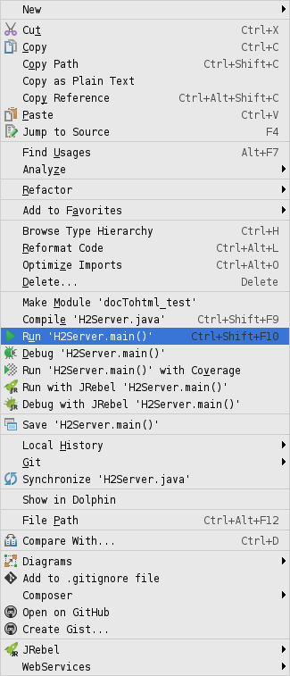
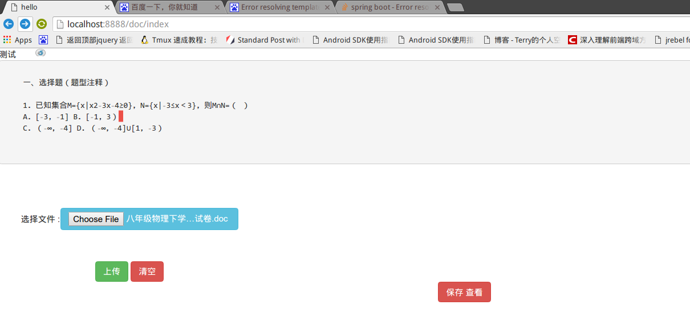
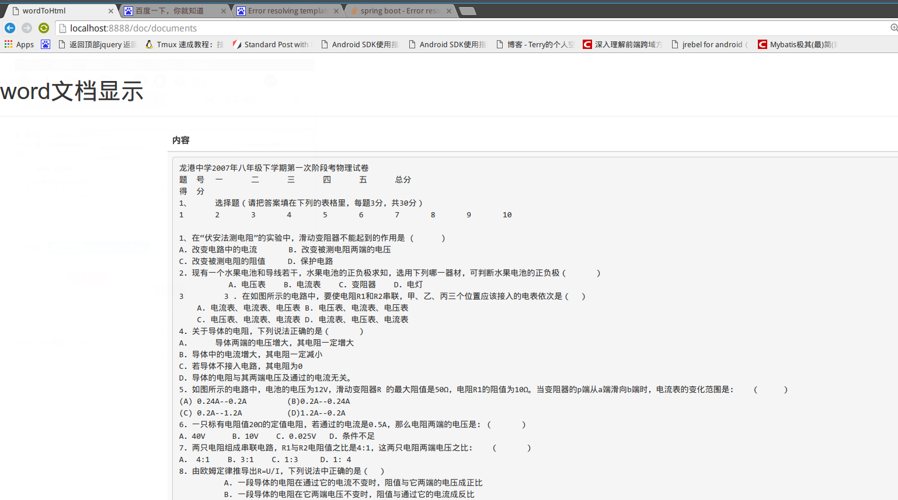

# docTohtml
springMVC+Hibernate 读取 word 到html页面

##### 由于对纯 java code 配置方式不太熟练,导致大量查阅 耗时, 比较喜欢这种简介配置方式,相较于以前使用的xml方式.过程中也不断学到新内容

--- 

启动前需先启动 H2 数据库 :
-------
  test > java > H2Server  包下 :

gradle 工程 ,idea 选择  gradle 导入,  运行 选择 Tasks 下 gretty 下  TomcatStart 启动 ,  端口 8888
------

#### 访问 : 

http://localhost:8888/doc
  

 index Page
=====

upload Page
-----

contentView
------

资料汇总：

openoffice版：
http://huangronaldo.iteye.com/blog/1628339

jacob版：
http://www.iteye.com/problems/15616

三种方式：
http://feifei.im/archives/93
