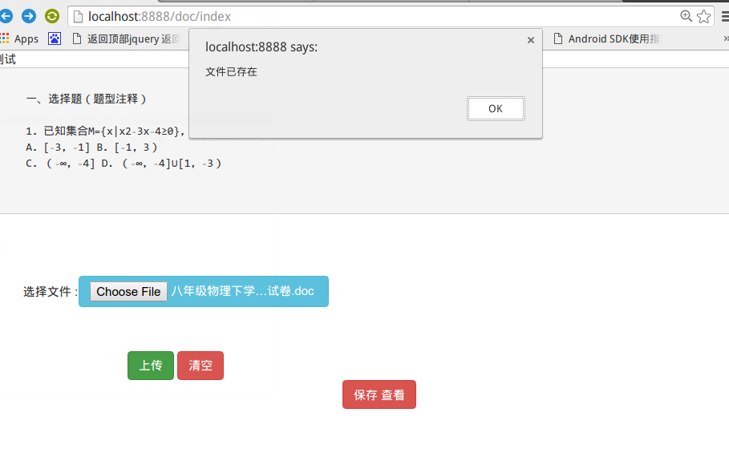

# docTohtml
springMVC+Hibernate 读取 word 到html页面

gradle 工程 ,idea 选择  gradle 导入,  运行 选择 Tasks 下 gretty 下  TomcatStart 启动 ,  端口 8888
------

#### 访问 : 
 http://localhost:8888/doc
  

 index Page
=====

upload Page
-----

contentView
------

